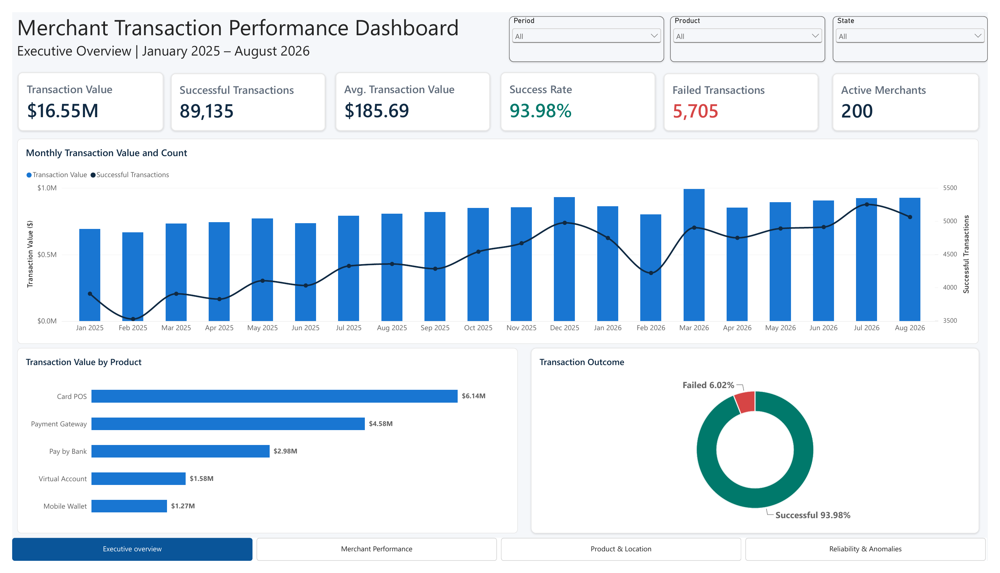
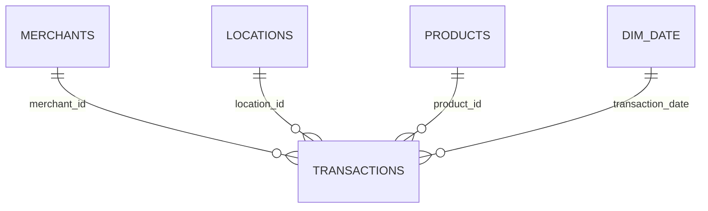
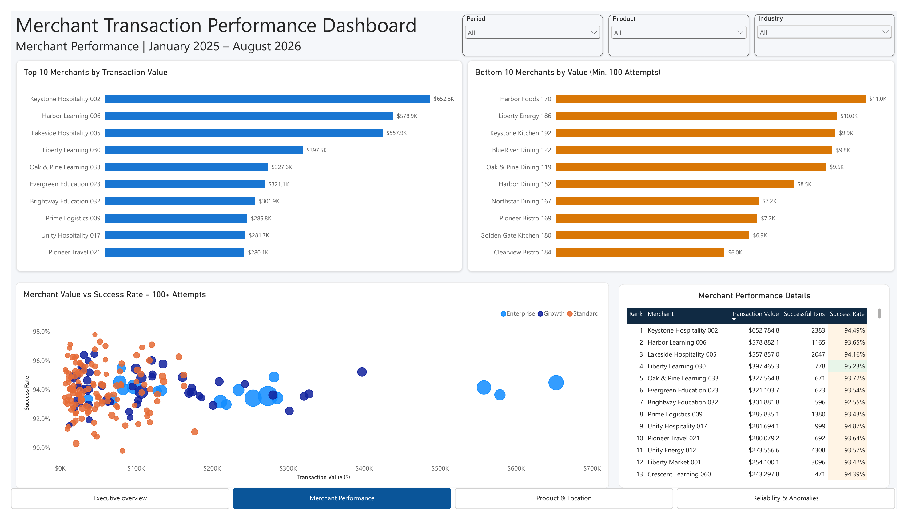
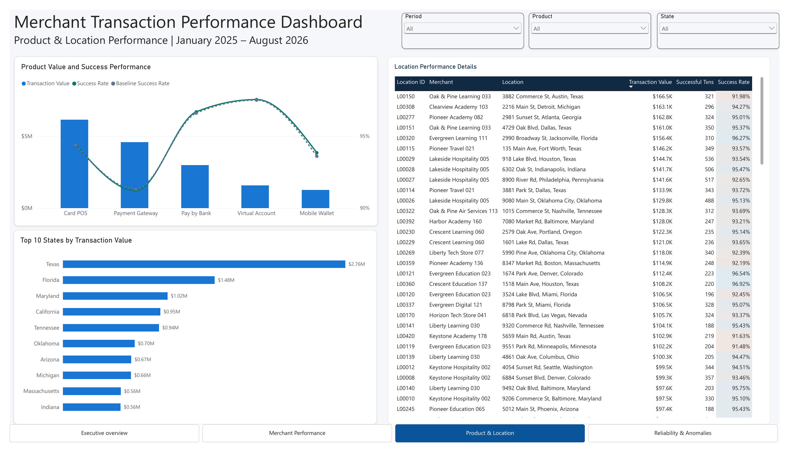
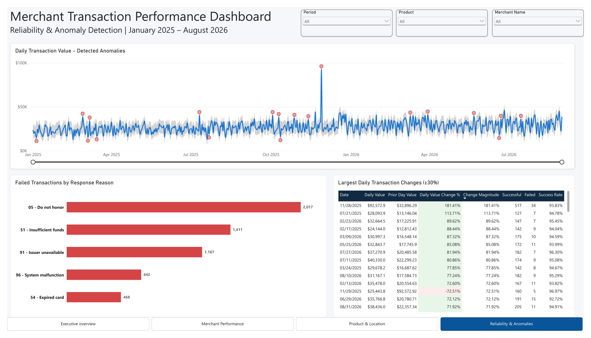

# Merchant Transaction Performance Dashboard

**End-to-end data analytics portfolio project using PostgreSQL, Power BI and Google Sheets**

> **Data notice:** This project uses fully synthetic merchant and transaction data created for portfolio demonstration. It contains no real customer, cardholder or company information.
 ## Project files

- [Download the editable Power BI project (.pbix)](merchant_transaction_performance_dashboards.pbix)
- [View the complete dashboard report (.pdf)](dashboard_report.pdf)



## Executive summary

This project analyses merchant transaction performance across products, locations and transaction outcomes. I built a relational PostgreSQL database, validated the data with SQL, created a star-schema semantic model in Power BI and designed a four-page dashboard for executive monitoring and operational investigation.

The final model covers **94,840 transaction attempts**, **200 merchants**, **456 locations** and **five payment products** from **January 2025 through August 2026**.

## Business problem

A payment operations team needs a single reporting view that can answer the following questions:

- How much successful transaction value and volume is being processed?
- How is performance changing daily and monthly?
- Which merchants and products generate the most and least value?
- Which locations contribute most strongly to performance?
- What percentage of transactions succeed or fail?
- Which response reasons drive failures?
- Which daily movements require investigation?

## Tools used

| Tool | Purpose |
|---|---|
| Google Sheets | Initial data review and formatting checks |
| PostgreSQL | Relational storage, joins and data-quality validation |
| SQL | Duplicate, integrity, date-range and transaction-status checks |
| Power BI | Data modelling, DAX measures, interactive analysis and dashboard design |

## Dataset and model

| Item | Coverage |
|---|---:|
| Transaction attempts | 94,840 |
| Successful transactions | 89,135 |
| Failed transactions | 5,705 |
| Merchants | 200 |
| Merchant locations | 456 |
| Products | 5 |
| Date range | 1 January 2025 - 31 August 2026 |

The semantic model follows a star-schema structure. The transaction table is the fact table, while merchants, locations, products and dates provide descriptive filtering dimensions.



Each dimension-to-transaction relationship is one-to-many with single-direction filtering. This prevents ambiguous filter paths and keeps the model predictable.

## Analytical workflow

1. Reviewed the source tables and standardised dates, identifiers, amounts and percentage fields.
2. Loaded merchant, location, product and transaction tables into PostgreSQL.
3. Verified primary-key uniqueness, foreign-key coverage, record counts, status values and the reporting date range.
4. Imported the validated tables into Power BI.
5. Created a dedicated date table and marked it as the model's date table.
6. Built reusable DAX measures for value, volume, success, failure, averages, period changes and merchant rankings.
7. Designed four report pages for executive, merchant, product/location and reliability analysis.
8. Added synchronized filters and page navigation, then reconciled the final results against PostgreSQL totals.

## Metric definitions

- **Transaction Attempts:** Every transaction record, regardless of outcome.
- **Successful Transactions:** Attempts whose status is `Successful`.
- **Failed Transactions:** Attempts whose status is `Failed`.
- **Transaction Value:** Amount from successful transactions only. Failed attempts are excluded from processed value.
- **Average Transaction Value:** Successful transaction value divided by successful transaction count.
- **Success Rate:** Successful transactions divided by total attempts.
- **Active Merchants:** Distinct merchants with at least one successful transaction in the selected context.

## Core results

| KPI | Result |
|---|---:|
| Successful transaction value | $16,551,459.12 |
| Successful transactions | 89,135 |
| Failed transactions | 5,705 |
| Average transaction value | $185.69 |
| Success rate | 93.98% |
| Failure rate | 6.02% |
| Active merchants | 200 |

## Key findings

- **Card POS generated $6.14M**, approximately **37.1%** of successful value. Payment Gateway contributed another **27.7%**. Together, the two products represented about **64.8%** of successful value.
- The three highest-value merchants generated approximately **$1.79M**, or **10.8%** of total successful value. This suggests that portfolio value was not dominated by a single merchant.
- Texas was the highest-value state at approximately **$2.76M**. The five leading states contributed about **43.2%** of successful transaction value.
- Response codes **05, 51 and 91** accounted for approximately **80.5%** of all failed attempts. Operational improvements should therefore begin with these three causes.
- The largest detected daily increase occurred on **28 November 2025**, when successful value reached approximately **$92.6K**, an increase of **181.4%** from the previous day. The following day declined by **72.5%**, showing why spikes must be reviewed in context rather than automatically treated as sustainable growth.
- Monthly value generally increased across the reporting period, but recurring dips demonstrate that transaction count and value should be monitored together.

## Important analytical decisions

### Bottom-merchant eligibility

The Bottom 10 analysis includes only merchants with at least **100 transaction attempts**. Without this threshold, newly onboarded or extremely low-volume merchants would dominate the list and produce a misleading performance comparison.

### Anomaly detection

Two complementary methods are used:

- Power BI's statistical anomaly detection identifies observations outside an expected range.
- A transparent rule-based table flags dates whose absolute day-over-day value change is at least **30%**.

These methods identify investigation candidates; they do not prove fraud, outages or causation.

### Location analysis

Location performance is presented through a ranked state chart and a detailed location table. This keeps the report portable and avoids relying on an online mapping visual that may require organizational sign-in.

## Dashboard pages

### 1. Executive Overview

High-level KPIs, monthly value and volume trends, product contribution and transaction outcomes.


### 2. Merchant Performance

Top and bottom merchants, value-versus-success-rate distribution and merchant-level details. Conditional formatting separates weak, moderate and strong success rates.



### 3. Product and Location Performance

Product value, actual-versus-baseline success rates, leading states and detailed location performance.



### 4. Reliability and Anomalies

Daily anomaly detection, failure reasons and the largest day-over-day transaction changes.



## Selected DAX measures

```DAX
Transaction Value =
CALCULATE(
    SUM(transactions[amount_usd]),
    transactions[status] = "Successful"
)
```

```DAX
Success Rate =
DIVIDE(
    [Transaction Count],
    [Transaction Attempts],
    0
)
```

```DAX
Unusual Daily Change Flag =
VAR Change = [Daily Value Change %]
RETURN
    IF(
        NOT ISBLANK(Change)
            && ABS(Change) >= 0.30,
        1,
        0
    )
```

## Data-quality checks

- Transaction attempts reconcile: **89,135 successful + 5,705 failed = 94,840 total attempts**.
- Duplicate `transaction_id` values: **0**.
- Orphan merchant, location and product keys: **0**.
- Invalid transaction statuses: **0**.
- The validated date range is **1 January 2025 through 31 August 2026**.

## Limitations

- The dataset is synthetic, so findings demonstrate analytical technique rather than real commercial performance.
- The dashboard is a Power BI Desktop snapshot and does not include scheduled refresh or production alerting.
- Statistical anomalies and percentage-change flags require operational context before action is taken.
- Successful value is not revenue or profit; it represents processed transaction amount.

## What this project demonstrates

- Relational database design and SQL validation
- Star-schema modelling
- DAX measure development
- KPI definition and reconciliation
- Merchant, product and geographic analysis
- Failure analysis and anomaly detection
- Business-focused dashboard design
- Clear communication of assumptions and limitations

